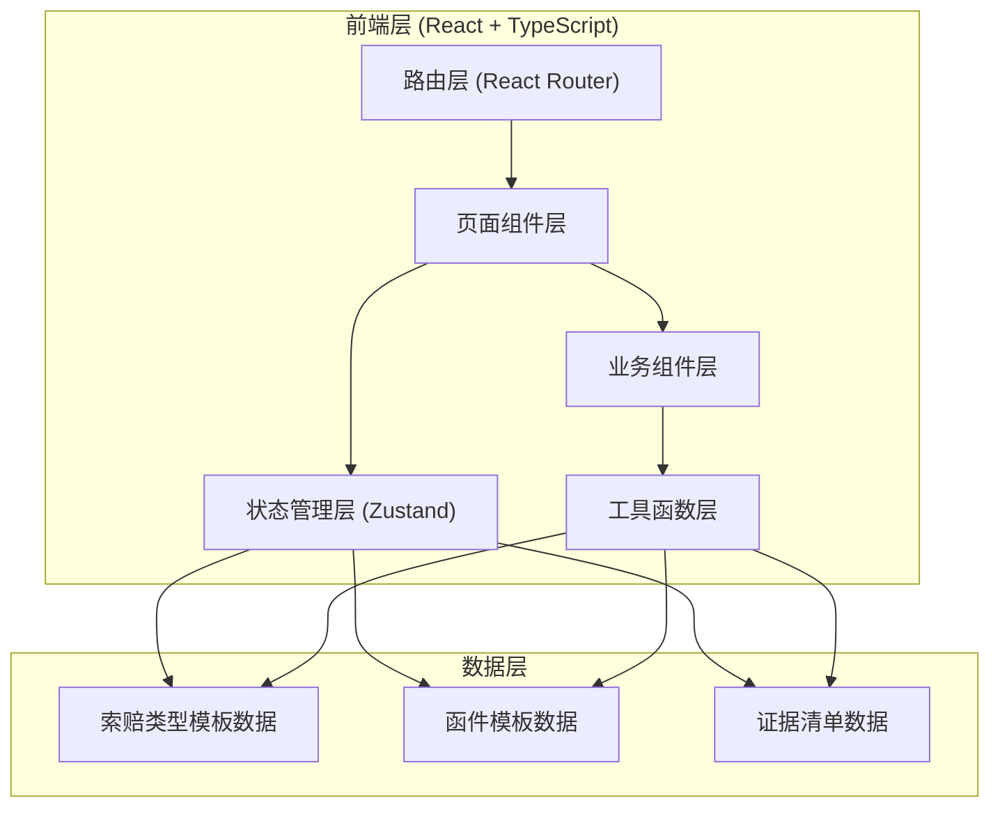

## 1. 架构设计



## 2. 技术选型说明

- **前端框架**: React@18 + TypeScript + Vite
- **初始化工具**: vite-init (react-ts 模板)
- **路由管理**: react-router-dom@6
- **状态管理**: zustand (轻量级状态管理，存储表单数据和生成结果)
- **样式方案**: TailwindCSS@3
- **图标库**: lucide-react
- **后端**: 无（纯前端工具，数据存储在浏览器内存中）
- **数据库**: 无

## 3. 路由定义

| 路由 | 用途 |
|------|------|
| / | 首页 - 索赔类型选择 |
| /form | 信息填写页 - 结构化表单录入 |
| /preview | 函件预览页 - 生成结果 + 缺失证据标注 |
| /edit | 函件修改页 - 措辞强硬程度调整 |

## 4. 状态模型 (Zustand Store)

```typescript
// 索赔类型枚举
type ClaimType = 'owner_delay' | 'design_change' | 'material_delay';

// 函件类型枚举
type LetterType = 'intent_notice' | 'claim_report' | 'reminder';

// 措辞强度 0-100 (0=商务协商, 100=合同维权)
type ToneLevel = number;

// 表单数据接口
interface ClaimFormData {
  claimType: ClaimType | null;
  contractClause: string;        // 合同条款编号
  eventDescription: string;      // 事件经过
  confirmedDays: number;         // 已确认天数
  incurredCost: number;          // 已发生费用(元)
  evidences: string[];           // 已有的证据清单
  customEvidence: string;        // 自定义补充证据
}

// 生成结果接口
interface GeneratedResult {
  letterType: LetterType;
  content: string;
  missingEvidences: string[];    // 缺失的证据列表
  toneLevel: ToneLevel;
}

// Store 状态
interface ClaimStore {
  formData: ClaimFormData;
  result: GeneratedResult | null;
  setFormData: (data: Partial<ClaimFormData>) => void;
  setClaimType: (type: ClaimType) => void;
  generateLetter: (letterType: LetterType) => void;
  setToneLevel: (level: ToneLevel) => void;
  reset: () => void;
}
```

## 5. 数据模型

### 5.1 索赔类型配置

```typescript
const CLAIM_TYPES = [
  {
    id: 'owner_delay',
    title: '业主原因停工',
    description: '因业主方未按时交付场地、付款延迟、指令错误等原因导致的停工索赔',
    icon: 'Building2',
    requiredEvidences: ['监理停工令', '业主书面通知', '人员考勤记录', '机械租赁证明', '材料进场记录']
  },
  {
    id: 'design_change',
    title: '设计变更导致窝工',
    description: '因设计图纸变更、技术交底不清导致的人员窝工和机械闲置',
    icon: 'PencilRuler',
    requiredEvidences: ['设计变更通知单', '工程洽商记录', '人员窝工考勤', '机械闲置签证', '现场照片']
  },
  {
    id: 'material_delay',
    title: '甲供材料延误',
    description: '因甲方供应材料设备未按时进场导致的工期延误和费用增加',
    icon: 'Package',
    requiredEvidences: ['甲供材料需求计划', '材料进场延误确认单', '人员窝工记录', '机械闲置证明', '工期延误签证']
  }
];
```

### 5.2 函件模板结构

每种索赔类型 × 每种函件类型 × 每种措辞强度，对应不同的模板段落：
- 称谓与开头
- 事实陈述段落
- 合同依据段落
- 索赔诉求（工期/费用）
- 证据清单列举
- 结尾与落款

模板使用占位符如 `{{contractClause}}`、`{{days}}`、`{{cost}}` 等，生成时动态替换。
